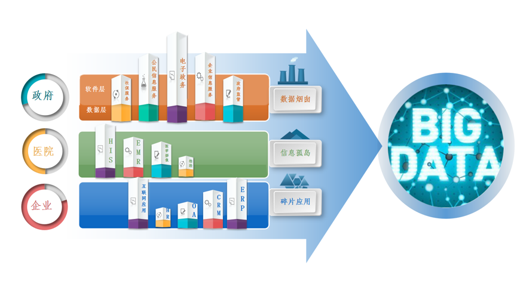
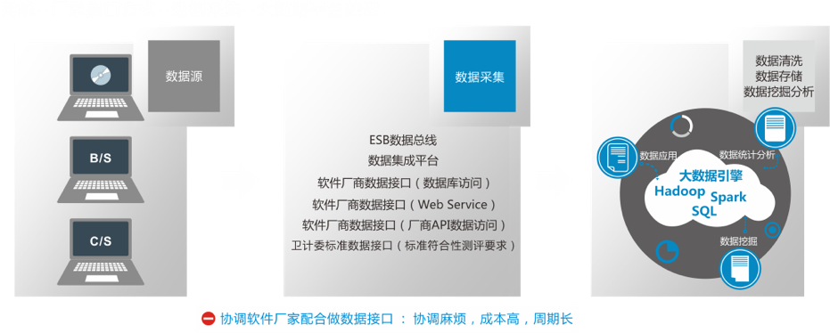
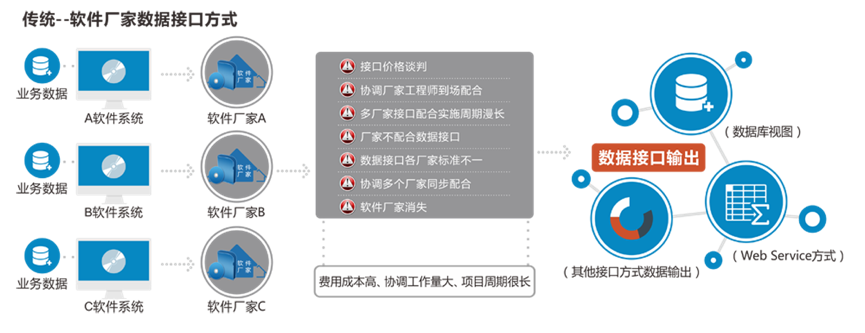

#  实战

##  行业现状

 “十二五”以来，我国医疗健康信息标准开发工作已取得显著成果，围绕医院信息化建设、区域卫生信息化建设等多个方面分期分批编制完成了283项国家医疗健康信息标准，建立起了我国医疗健康信息标准开发主体框架，促进了各省市、各医疗机构信息互联互通与业务交互。为推动标准的应用落地，提升各级各类医疗卫生机构信息化、标准化建设与应用水平，国家卫生计生委统计信息中心自2013年开始组织开展国家医疗健康信息互联互通标准化成熟度测评试点工作。通过2013-2016年四批测评试点工作的开展，我国医疗健康信息标准实施评价技术体系已经建立，现有各项标准的内容及质量得到了实践校验和完善提升，共计39个市（县）区域平台和40个医院平台通过测评，初步构建了涵盖12个分级管理单位的国家—省两级测评分级管理体系，创建了一批标准化应用示范单位,有效推进了跨机构、跨地域的互联互通和信息共享。但是区域平台、医院信息平台的落地和后续数据挖掘分析应用实际很受限，主要原因在于：
(1)	受制于医院内部信息系统非常多，不同的设备配置不同软件，不同的软件又由上千家供应商提供，各系统临床数据难以融合；而联通信息孤岛，本身需要极大的人力、资金与时间投入；而实现医联（共）体与各区域内（省、市、县）大数据融合，则更是耗资巨大的浩瀚工程
(2)	行业通用的传统软件厂家之间进行数据接口的方式成本高，代价大，协调各方非常麻烦; 由于每个软件都是各个厂家开发的，获得某个软件的数据只能够和这个软件厂家进行数据接口对接工作，而每个软件厂家的配合需要的费用，相互协调配合的工作量非常巨大，很多医院客户的信息科在各个软件系统的协调配合上花费了大量的时间和成本，却难以达到理想效果。 

目前为了将所有软件系统数据采集汇聚，形成数据池，从而为大数据分析与应用提供数据基础，通常都是这么做的：

但单纯依赖这些传统数据打通方式打通数据的问题在于：

(1)	数据接口开发方面：数据对接工作量大，接口开发成本高，接口价格谈判时有些系统狮子大张口10W-100W不等，且接口开发工作周期长,并且无法保证持续的维护，经常出现接口崩掉之后一两个月都无法恢复，影响医院正常业务的开展
(2)	数据接口对接方面：协调厂家工程师到场配合麻烦，厂家不配合数据接口，多厂家接口配合实施周期漫长不可控，协调多个厂家同步配合，数据接口各厂家标准不一，或者有的厂家已经消失，有些系统还不支持数据接口
(3)	数据实时性和数据质量：数据上报不及时不全面，数据类型不符合要求，限制了数据的分析应用

## 问题一：你这个标准有什么用   

对于只关注自己产品内部的单个产品的开发商而言，你有多种平台产品  公众号、APP、BS的 web 网站、CS 的客户端，是不是针对每一种都要开发一个后台，怎么样共享一个后台，同一份数据，怎么样适应频繁变更的前端需求、各种各样的前端框架，怎么样降低由此带来的额外开发成本。当当当 请想起我。

## 问题二：我要怎么用  

## 基于现有系统开发新的业务系统——做接口

## 基于现有系统与其他系统做数据集成——做平台

## 从零开始开发新的业务系统——做系统

这也正是本节课所要完成的目标。目前国内医疗信息化厂商多使用 Oracle sqlserver mysql 数据库，医院内部的信息系统集成多采用点对点的接口模式，多采用 XML 的 SOAP 服务。目前已有一些大型三甲基于集成平台/院内信息平台实现了系统的互联互通，协议仍然多以XML 为主，由于使用了国外的数据引擎，故而部分是支持国家标准诸如 HL7 V2.X V3 CDA。对于实现了市级、区级的人口健康信息平台的城市，医疗机构之间仍多以前置机方式实现数据交互。下面我们以典型的院内HIS表结构(军卫一号)和某达的前置机表结构来给大家示范 GraphQL 如何在系统互联互通 接口设计和开发中应用来降低接口重复开发的成本。

